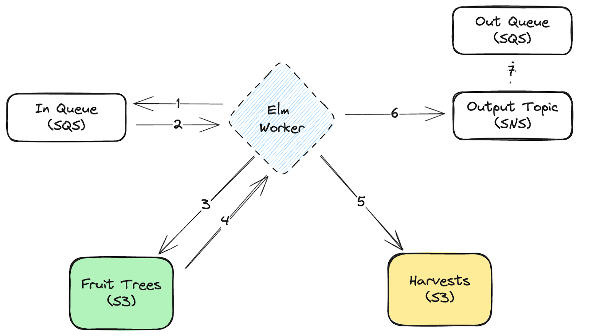

## Fruits Pipeline Worker

A fruit picking worker process that talks to AWS services.

### Steps:

1. The worker polls an SQS queue for messages which contain the location of the fruit trees (S3).
2. The worker then loads the data for the fruit trees from S3 and harvests the fruit (i.e. runs some logic).
3. The harvests are then saved in an S3 bucket.
4. The worker publishes an SNS message which can then be picked up by external servives.



## Run it locally

Add the env vars to your shell:

```
export IN_QUEUE=tasks-in
export OUT_BUCKET=out-bucket
export OUT_TOPIC=tasks-out
export AWS_ACCESS_KEY_ID=ANY
export AWS_SECRET_ACCESS_KEY=ANY_SECRET
```

1. Install dependencies:

```
npm install
```

2. Start local infrastructure (localstack):

```
npm run infra
```

3. Start the worker process:

```
npm start
```

4. Send a message to SQS for the worker to pick up:

```
npm run send-message
```

You should see the worker picking up the message and harvesting the fruits! 🍓
